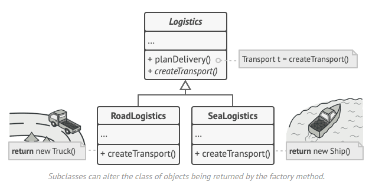

# Factory Pattern

## Definition

The **Factory Pattern** is a **creational design pattern** that provides an interface for creating instances of a class, while letting subclasses (or concrete factory classes) decide which class to instantiate. It promotes loose coupling by eliminating the need to bind application-specific classes into the code directly.

## Must Read
https://refactoring.guru/design-patterns/factory-method

The Factory Method pattern suggests that you replace direct object construction calls (using the new operator) with calls to a special factory method. Don’t worry: the objects are still created via the new operator, but it’s being called from within the factory method. Objects returned by a factory method are often referred to as products.


Instead of calling a constructor directly:
```java
new ConcreteProduct()
```
you call a factory method:
```java
Product p = factory.createProduct();
```

There are several variants:
- **Simple Factory** (not a GoF pattern, but commonly used)
- **Factory Method** (GoF pattern)
- **Abstract Factory** (GoF pattern – creates families of related objects)

Below we focus on the **Factory Method** pattern, the most commonly referred to when people say "Factory Pattern".

## Factory Method – Structure

```text
+----------------+          +---------------------+
|    Client      |          |    Creator          |
+----------------+          +---------------------+
         ^                           ^       ^
         |                           |       |
   uses  |                     abstract  | implements
         |                           |
   +-----------+               +-----------+
   | Product   |<--------------| ConcreteCreator |
   +-----------+   creates     +-----------+
         ^                           |
         |                           |
   implements                 creates
         |                           |
   +----------------+          +-----------------+
   | ConcreteProduct|          | ConcreteProduct |
   +----------------+          +-----------------+
```

## Sample Code

# Factory Method Pattern in C#

```csharp
// Product interface
public interface IButton
{
    void Render();
    void OnClick();
}

// Concrete products
public class WindowsButton : IButton
{
    public void Render() => Console.WriteLine("Rendering a Windows button");
    public void OnClick() => Console.WriteLine("Windows button clicked!");
}

public class MacButton : IButton
{
    public void Render() => Console.WriteLine("Rendering a Mac button");
    public void OnClick() => Console.WriteLine("Mac button clicked!");
}

// Creator (Factory Method)
public abstract class Dialog
{
    public void RenderDialog()
    {
        IButton okButton = CreateButton(); // Factory method
        okButton.Render();
    }

    // The factory method – subclasses decide the concrete type
    public abstract IButton CreateButton();
}

// Concrete creators
public class WindowsDialog : Dialog
{
    public override IButton CreateButton() => new WindowsButton();
}

public class MacDialog : Dialog
{
    public override IButton CreateButton() => new MacButton();
}

// Client code
public class Application
{
    private Dialog _dialog;

    public void Initialize(string os)
    {
        _dialog = os switch
        {
            "Windows" => new WindowsDialog(),
            "Mac"     => new MacDialog(),
            _         => throw new ArgumentException("Unknown OS")
        };
    }

    public void Render()
    {
        _dialog.RenderDialog();
    }

    // Demo
    public static void Main(string[] args)
    {
        var app = new Application();

        // Simulate running on different platforms
        app.Initialize("Mac");
        app.Render();
        // Output: Rendering a Mac button

        Console.WriteLine();

        app.Initialize("Windows");
        app.Render();
        // Output: Rendering a Windows button
    }
}
```


```text
### Output
Rendering a Mac button

Rendering a Windows button
```
```text

                        +------------------+
                        |     IButton      |  ← What we want (interface)
                        +------------------+
                               /\
                               || implements
               ________________/  \_________________
              /                                     \
    +------------------+                  +------------------+
    |  WindowsButton   |                  |    MacButton     |
    +------------------+                  +------------------+

                               ^
                               |  (uses the factory method)
                               |
                        +------------------+
                        |      Dialog      |  ← Abstract class
                        |------------------|
                        | CreateButton()    |  ← ABSTRACT method!
                        | RenderDialog()   |
                        +------------------+
                               /\
                               || inherits & overrides
               ________________/  \_________________
              /                                     \
    +------------------+                  +------------------+
    | WindowsDialog    |                  |    MacDialog     |
    |------------------|                  |------------------|
    | CreateButton()   |──returns──▶      | CreateButton()   |──returns──▶
    | → new WindowsButton()               | → new MacButton()
    +------------------+                  +------------------+
```
---

### How It Works – Step by Step

1. The **client** (your app) only knows about `Dialog` — never about `WindowsDialog` or `MacButton`.
2. You call `dialog.RenderDialog()`
3. Inside `RenderDialog()`, it calls `CreateButton()` → this is the **magic factory method**
4. Depending on which `Dialog` you have:
   - `WindowsDialog.CreateButton()` → returns a `WindowsButton`
   - `MacDialog.CreateButton()` → returns a `MacButton`
5. The button is rendered → correct look for the current OS!

**Client code stays clean and doesn't need if/else for platforms!**

---

## Real-World Examples

| Domain                  | Real-World Usage                                                                 | Benefit |
|-------------------------|----------------------------------------------------------------------------------|---------|
| **GUI Toolkits**        | Swing, JavaFX, Qt – creating platform-specific widgets (buttons, dialogs) without hardcoding OS-specific classes | Same code runs on Windows, macOS, Linux |
| **Database Drivers**    | `DriverManager.getConnection()` in JDBC – returns different driver implementations based on URL | Client code doesn't need to know about MySQL vs PostgreSQL drivers |
| **Logging Frameworks**  | Log4j/Logback – `LoggerFactory.getLogger()` returns appropriate logger (console, file, etc.) | Easy swapping of logging backends |
| **Game Development**    | Creating enemies or items: `EnemyFactory.create("dragon")` returns a Dragon instance | Add new enemy types without changing existing code |
| **Dependency Injection**| Spring's `@Bean` methods or Guice providers act as factory methods | Decouples object creation from usage |

## When to Use Factory Method

- A class cannot anticipate the type of objects it needs to create.
- You want to localize the knowledge of which class gets created.
- You want to delegate object creation to subclasses.
- You need to support extensibility (e.g., adding support for a new platform).

The Factory Pattern is one of the most widely used patterns in real-world frameworks and libraries because it makes systems flexible, extensible, and testable.

## Comparison with Abstract Factory

look next file