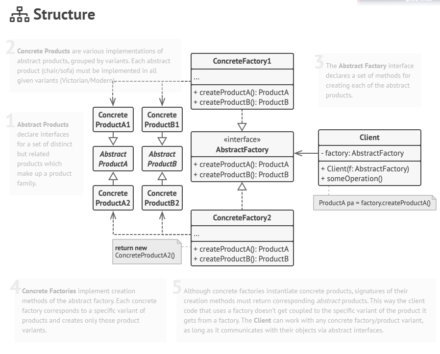
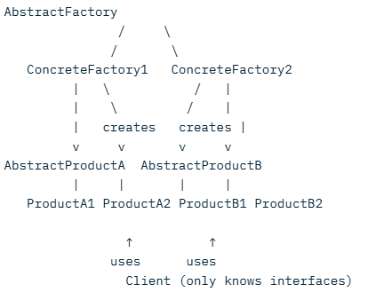
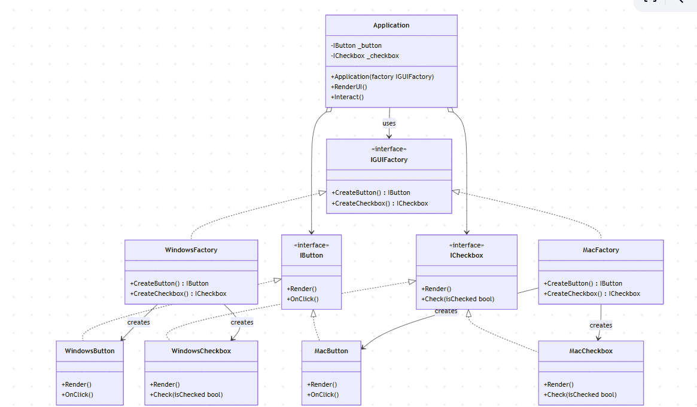

# Abstract Factory Pattern in C#

## Definition

The **Abstract Factory** is a creational design pattern that provides an interface for creating families of related or dependent objects without specifying their concrete classes.

It allows a client to create objects that belong to a consistent theme or family (e.g., UI components for different operating systems) while remaining decoupled from concrete implementations.

## Important Links
https://refactoring.guru/design-patterns/abstract-factory



Key participants:
- **AbstractFactory** – declares an interface for creating abstract products
- **ConcreteFactory** – implements the creation of concrete products
- **AbstractProduct** – declares an interface for a type of product
- **ConcreteProduct** – implements the AbstractProduct interface
- **Client** – uses only interfaces declared by AbstractFactory and AbstractProduct


## Real-World Example

A cross-platform UI toolkit that renders buttons and checkboxes differently on **Windows** and **macOS**, but the application code remains the same regardless of the operating system.

## Sample Code in C#

```markdown
```csharp
// Abstract products
public interface IButton
{
    void Render();
    void OnClick();
}

public interface ICheckbox
{
    void Render();
    void Check(bool isChecked);
}

// Concrete products for Windows
public class WindowsButton : IButton
{
    public void Render() => Console.WriteLine("Rendering a button in Windows style");
    public void OnClick() => Console.WriteLine("Windows button clicked!");
}

public class WindowsCheckbox : ICheckbox
{
    public void Render() => Console.WriteLine("Rendering a checkbox in Windows style");
    public void Check(bool isChecked) => Console.WriteLine($"Windows checkbox checked: {isChecked}");
}

// Concrete products for macOS
public class MacButton : IButton
{
    public void Render() => Console.WriteLine("Rendering a button in macOS style (flat & rounded)");
    public void OnClick() => Console.WriteLine("macOS button clicked with ripple effect!");
}

public class MacCheckbox : ICheckbox
{
    public void Render() => Console.WriteLine("Rendering a checkbox in macOS style");
    public void Check(bool isChecked) => Console.WriteLine($"macOS checkbox checked: {isChecked}");
}

// Abstract Factory : declares an interface for creating abstract products
public interface IGUIFactory
{
    IButton CreateButton();
    ICheckbox CreateCheckbox();
}

// Concrete Factories : implements the creation of concrete products
public class WindowsFactory : IGUIFactory
{
    public IButton CreateButton() => new WindowsButton();
    public ICheckbox CreateCheckbox() => new WindowsCheckbox();
}

public class MacFactory : IGUIFactory
{
    public IButton CreateButton() => new MacButton();
    public ICheckbox CreateCheckbox() => new MacCheckbox();
}

// Client code (completely decoupled from concrete classes)
public class Application
{
    private readonly IButton _button;
    private readonly ICheckbox _checkbox;

    public Application(IGUIFactory factory)
    {
        _button = factory.CreateButton();
        _checkbox = factory.CreateCheckbox();
    }

    public void RenderUI()
    {
        _button.Render();
        _checkbox.Render();
    }

    public void Interact()
    {
        _button.OnClick();
        _checkbox.Check(true);
    }
}

// Usage
class Program
{
    static void Main()
    {
        Console.WriteLine("=== Running on Windows ===");
        var windowsApp = new Application(new WindowsFactory());
        windowsApp.RenderUI();
        windowsApp.Interact();

        Console.WriteLine("\n=== Running on macOS ===");
        var macApp = new Application(new MacFactory());
        macApp.RenderUI();
        macApp.Interact();
    }
}
```

## Output
```
=== Running on Windows ===
Rendering a button in Windows style
Rendering a checkbox in Windows style
Windows button clicked!
Windows checkbox checked: True

=== Running on macOS ===
Rendering a button in macOS style (flat & rounded)
Rendering a checkbox in macOS style
macOS button clicked with ripple effect!
macOS checkbox checked: True
```

   
## When to Use Abstract Factory

- When your system must be independent of how its objects are created, composed, and represented
- When you need to support multiple families of related objects (themes, platforms, styles)
- When you want to enforce that only compatible products are used together
- When you want to reveal only interfaces, not implementations

The Abstract Factory pattern is widely used in UI frameworks (e.g., Material Design vs iOS Human Interface vs Windows Fluent), game engines (different rendering systems), and any application requiring pluggable themes or platform-specific behaviors.
```