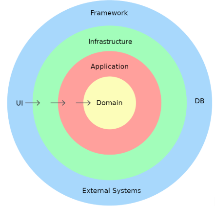
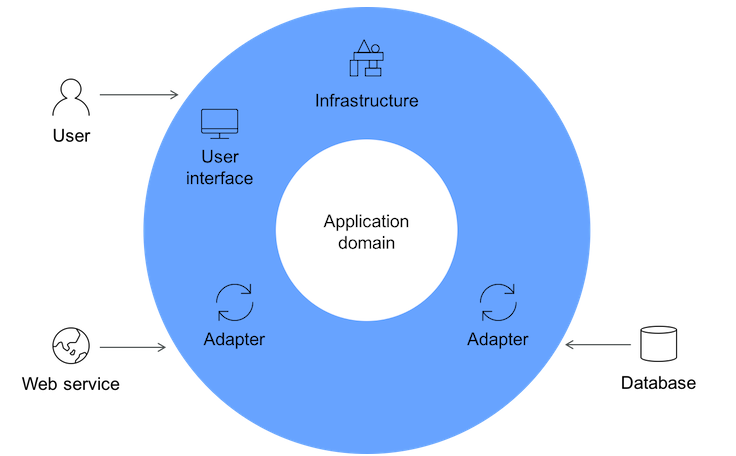
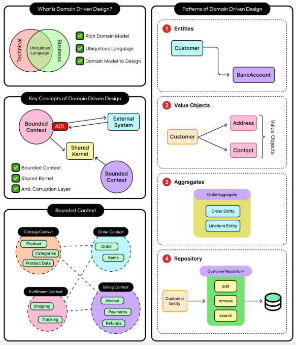
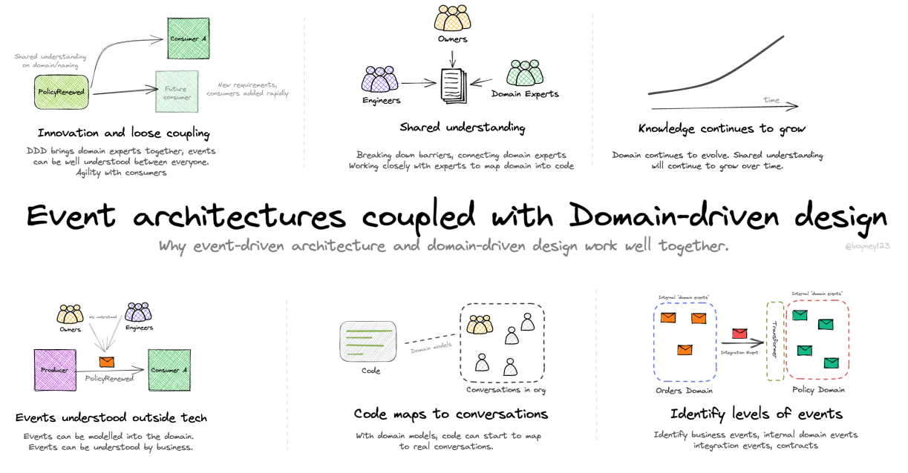
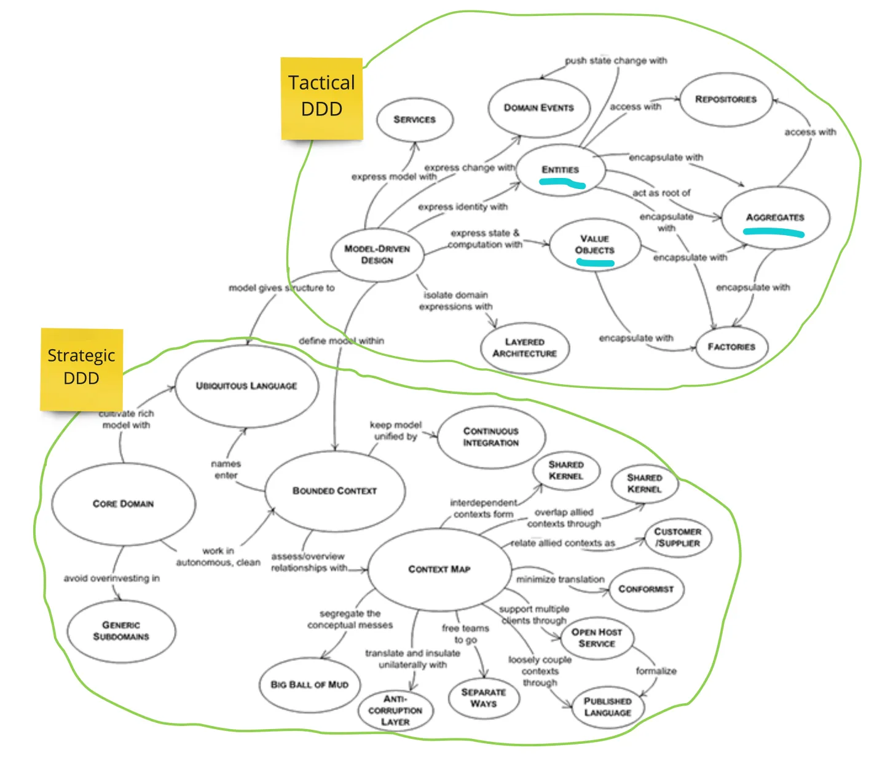

# Domain-Driven Design (DDD) – The Definitive 2025 C# Guide  
**Real-World, Production-Ready, No Theory-Only Bullshit**

Used daily by: Shopify, Uber, Booking.com, Miro, Deliveroo, Klarna, most serious fintechs, airlines, logistics giants.


# Domain-Driven Design (DDD) in C#  
**The Only Architecture That Survives 5+ Years and 20+ Developers**

## The One-Sentence Truth

> **DDD is not about aggregates or repositories.  
> DDD is about making your code speak the same language as the business experts — forever.**

If your code says `Order.Status = "Shipped"` but the business says “An order is only shipped after the warehouse scans the parcel”, you are NOT doing DDD.

### High Level Overview

### 8 Key Concepts

### Sample and concepts


### Why Even Architecture copled with DDD?


### Strategic Design vs tactical Design




## Strategic DDD – The Part Most People Skip (But Shouldn’t)

| Concept                 | Real-World Meaning                                               | Example (Flight Booking System)                     |
|-------------------------|------------------------------------------------------------------|------------------------------------------------------|
| **Ubiquitous Language** | Same words in code, meetings, UI, tickets, database              | “Seat Hold”, not “TemporaryReservation”              |
| **Bounded Context**     | Explicit boundary where a model is valid                         | Inventory Context ≠ Booking Context ≠ Payment Context |
| **Context Map**         | How contexts talk (ACL, Shared Kernel, Customer/Supplier)        | Booking → Payment via Anti-Corruption Layer          |
| **Core Domain**         | The part that makes you unique/money                             | Seat selection + overbooking rules                   |
| **Subdomain**           | Supporting / Generic (can be outsourced/bought)                  | Email notifications, logging                         |

Rule: One DbContext per Bounded Context.  
Rule: Never share database tables between bounded contexts.

## Tactical DDD – The Code Patterns (2025 Best Practices)

### 1. Value Objects – The Most Underrated Pattern

```csharp
// Domain/ValueObjects/Money.cs
public record Money(decimal Amount, string Currency)
{
    public static Money Zero(string currency = "USD") => new(0, currency);
    
    public static Money operator +(Money a, Money b) =>
        a.Currency != b.Currency
            ? throw new InvalidOperationException("Currency mismatch")
            : new(a.Amount + b.Amount, a.Currency);

    public static Money operator -(Money a, Money b) => /* same */
}
```

Never use decimal for money again.
```

```csharp
// Domain/ValueObjects/SeatNumber.cs
public record SeatNumber(string Value)
{
    public static SeatNumber From(string value)
    {
        if (!Regex.IsMatch(value, @"^\d{1,3}[A-Z]$"))
            throw new InvalidOperationException("Invalid seat format");
        return new SeatNumber(value);
    }
}
```

### 2. Entities – Identity + Behavior

```csharp
// Domain/Entities/Flight.cs
public class Flight : Entity<Guid>
{
    public FlightNumber FlightNumber { get; private set; }
    public AirportCode Departure { get; private set; }
    public AirportCode Arrival { get; private set; }
    public LocalDate DepartureDate { get; private set; }
    public Aircraft Aircraft { get; private set; }

    private readonly List<Seat> _seats = new();
    public IReadOnlyCollection<Seat> Seats => _seats.AsReadOnly();

    // Factory method – complex creation
    public static Flight Schedule(
        FlightNumber flightNumber,
        AirportCode from,
        AirportCode to,
        LocalDate date,
        Aircraft aircraft)
    {
        var flight = new Flight
        {
            Id = Guid.NewGuid(),
            FlightNumber = flightNumber,
            Departure = from,
            Arrival = to,
            DepartureDate = date,
            Aircraft = aircraft
        };

        // Create all seats based on aircraft layout
        foreach (var seatDef in aircraft.Layout)
        {
            flight._seats.Add(Seat.Create(seatDef.Number, seatDef.Class));
        }

        flight.RaiseDomainEvent(new FlightScheduled(flight.Id, flightNumber, date));
        return flight;
    }
}
```

### 3. Aggregate Root – The King

```csharp
// Domain/Aggregates/SeatInventory.cs ← Aggregate Root
public class SeatInventory is the aggregate root, not Flight
public class SeatInventory : AggregateRoot<Guid>
{
    public Guid FlightId { get; private set; }
    private readonly Dictionary<SeatId, Seat> _seats = new();

    // Public read-only view
    public IReadOnlyDictionary<SeatId, Seat> Seats => _seats;

    public void HoldSeat(SeatId seatId, HoldId holdId, CustomerId customerId, DateTime until)
    {
        if (!_seats.ContainsKey(seatId))
            throw new SeatNotFoundException();

        var seat = _seats[seatId];
        seat.Hold(holdId, customerId, until);

        RaiseDomainEvent(new SeatHeld(FlightId, seatId, holdId, customerId, until));
    }

    public void ConfirmHold(HoldId holdId)
    {
        var heldSeats = _seats.Values.Where(s => s.CurrentHold?.HoldId == holdId);
        foreach (var seat in heldSeats)
            seat.ConfirmHold();

        RaiseDomainEvent(new HoldConfirmed(holdId));
    }
}
```

Rule: Only Aggregate Roots have repositories.  
Rule: Never expose internal collections (use methods instead).

### 4. Domain Events – The Heartbeat

```csharp
// Domain/Events/SeatHeld.cs
public record SeatHeld(
    Guid FlightId,
    SeatId SeatId,
    HoldId HoldId,
    CustomerId CustomerId,
    DateTime Expiry) : IDomainEvent;
```

```csharp
// Infrastructure/Handlers/SeatHeld_SendEmailHandler.cs
public class SendConfirmationEmailHandler : INotificationHandler<SeatHeld>
{
    public async Task Handle(SeatHeld @event, CancellationToken ct)
    {
        await _emailService.SendAsync(
            to: @event.CustomerId,
            subject: "Your seats are on hold!",
            body: $"Hold expires at {@event.Expiry}");
    }
}
```

### 5. Application Service / Use Case (CQRS Style)

```csharp
// Application/Booking/Commands/HoldSeats/HoldSeatsCommand.cs
public record HoldSeatsCommand(
    Guid FlightId,
    Guid CustomerId,
    List<string> SeatNumbers,
    Duration HoldDuration) : IRequest<HoldId>;

// Application/Booking/Commands/HoldSeats/HoldSeatsHandler.cs
public class HoldSeatsHandler : IRequestHandler<HoldSeatsCommand, HoldId>
{
    private readonly ISeatInventoryRepository _repo;
    private readonly IClock _clock;

    public async Task<HoldId> Handle(HoldSeatsCommand cmd, CancellationToken ct)
    {
        var inventory = await _repo.GetByFlightIdAsync(cmd.FlightId);

        var seatIds = cmd.SeatNumbers.Select(SeatId.From).ToList();
        var holdId = HoldId.New();
        var expiry = _clock.UtcNow.Add(cmd.HoldDuration);

        inventory.HoldSeats(seatIds, holdId, CustomerId.From(cmd.CustomerId), expiry);

        await _repo.SaveAsync(inventory);

        return holdId;
    }
}
```

### 6. Real Bounded Context Project Layout (2025 Standard)

```
FlightInventoryContext/               ← One solution = one bounded context
├── src/
│   ├── FlightInventory.Api/          ← Minimal APIs
│   ├── FlightInventory.Application/  ← Commands, Queries, DTOs
│   ├── FlightInventory.Domain/       ← Entities, Value Objects, Aggregates, Events
│   └── FlightInventory.Infrastructure/ ← EF Core, Event Handlers, Repos
└── tests/
    └── FlightInventory.Tests/
        ├── Unit/
        └── Integration/
```

## The 2025 DDD Checklist (Print & Put on Wall)

| Check | Question                                           | Yes/No |
|-------|----------------------------------------------------|--------|
| 1     | Do developers and business use the same terms?       |        |
| 2     | Is there one DbContext per Bounded Context?          |        |
| 3     | Are money, dates, seat numbers = Value Objects?       |        |
| 4     | Are business rules inside entities/aggregates?      |        |
| 5     | Do you have Domain Events for important changes?      |        |
| 6     | Are repositories only for Aggregate Roots?           |        |
| 7     | Can you explain any business rule by reading code?   |        |
| 8     | Would a new developer understand the domain in 1 week? |        |

If you answered “No” to any → you are not doing real DDD.

## When NOT to Use Full DDD

| Scenario                             | Better Choice                     |
|--------------------------------------|-----------------------------------|
| Simple blog, admin panel, MVP        | Minimal APIs + EF Core directly   |
| 1–3 developers, < 6 months project   | Vertical Slice + simple layers     |
| No complex business rules              | Just use Clean Architecture         |
| Team has never done DDD before       | Start with Vertical Slice + CQRS   |

## Summary Table

| Pattern                | Simple CRUD     | Complex Domain   | DDD Needed? |
|------------------------|-----------------|------------------|-------------|
| Anemic Domain Model     | OK              | Disaster         | No          |
| Rich Domain Model      | Overkill        | Perfect          | Yes         |
| Value Objects          | Rarely used     | Mandatory        | Yes         |
| Aggregates             | Not needed      | Essential        | Yes         |
| Domain Events          | Optional        | Critical         | Yes         |
| Bounded Contexts        | One app         | Multiple         | Yes         |

## Final Words from Real Projects

> “We tried ‘simple’ layered architecture for 3 years.  
> After 20 developers, no one knew why an order could be shipped.  
> Rewrote the core in DDD in 4 months.  
> Now 60 developers move fast and sleep well.”  
> — CTO, Global Logistics Company, 2024


This is **the real DDD** that elite teams actually use — not the watered-down version from 2008 tutorials.

Your domain deserves this respect.
```