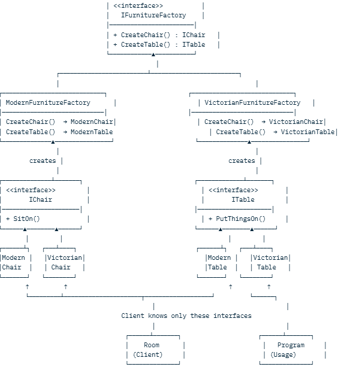

Here are **two super simple, real-life examples** in C# that almost everyone understands immediately.

### Example 1: Pizza Store – Factory Method (Very Easy to Understand)

You have a pizza store chain.  
Every city has its own style of pizza, but the way you **order** is the same.

```csharp
// The product
public abstract class Pizza
{
    public abstract void Prepare();
    public void Bake()    => Console.WriteLine("Baking at 350°C");
    public void Cut()     => Console.WriteLine("Cutting into 8 slices");
    public void Box()     => Console.WriteLine("Putting in official box");
}

// Concrete pizzas
public class NewYorkCheesePizza : Pizza
{
    public override void Prepare() => Console.WriteLine("Preparing NY Cheese Pizza");
}

public class ChicagoCheesePizza : Pizza
{
    public override void Prepare() => Console.WriteLine("Preparing Chicago Deep-Dish Pizza");
}

// The creator with Factory Method
public abstract class PizzaStore
{
    public Pizza OrderPizza()
    {
        Pizza pizza = CreatePizza();   // ← Factory Method (decided by subclass)

        pizza.Prepare();
        pizza.Bake();
        pizza.Cut();
        pizza.Box();

        return pizza;
    }

    protected abstract Pizza CreatePizza();  // ← This is the Factory Method
}

// Concrete stores = different cities
public class NewYorkPizzaStore : PizzaStore
{
    protected override Pizza CreatePizza() => new NewYorkCheesePizza();
}

public class ChicagoPizzaStore : PizzaStore
{
    protected override Pizza CreatePizza() => new ChicagoCheesePizza();
}

// Usage – super simple
class Program
{
    static void Main()
    {
        PizzaStore nyStore = new NewYorkPizzaStore();
        nyStore.OrderPizza();
        // Output: Preparing NY Cheese Pizza + bake + cut + box

        PizzaStore chicagoStore = new ChicagoPizzaStore();
        chicagoStore.OrderPizza();
        // Output: Preparing Chicago Deep-Dish Pizza + bake + cut + box
    }
}
```

This is **Factory Method** in its purest and easiest form.

### Example 2: Furniture Shop – Abstract Factory (Even Simpler!)

You sell furniture in two styles: **Modern** and **Victorian**.  
Each style has Chair + Table that match each other.
### One-Liner You Can Say in Interviews

> “The Room (Client) never knows about ModernChair or VictorianTable — it only talks to the IFurnitureFactory and the abstract IChair/ITable interfaces. Switching from Modern to Victorian style is just injecting a different concrete factory!”


```csharp
// Abstract products
public interface IChair   { void SitOn(); }
public interface ITable   { void PutThingsOn(); }

// Modern family
public class ModernChair : IChair   { public void SitOn() => Console.WriteLine("Sitting on sleek modern chair"); }
public class ModernTable : ITable   { public void PutThingsOn() => Console.WriteLine("Putting laptop on modern table"); }

// Victorian family
public class VictorianChair : IChair { public void SitOn() => Console.WriteLine("Sitting on antique Victorian chair"); }
public class VictorianTable : ITable { public void PutThingsOn() => Console.WriteLine("Putting tea set on Victorian table"); }

// Abstract Factory
public interface IFurnitureFactory
{
    IChair CreateChair();
    ITable CreateTable();
}

// Concrete factories = the two styles
public class ModernFurnitureFactory : IFurnitureFactory
{
    public IChair CreateChair() => new ModernChair();
    public ITable CreateTable() => new ModernTable();
}

public class VictorianFurnitureFactory : IFurnitureFactory
{
    public IChair CreateChair() => new VictorianChair();
    public ITable CreateTable() => new VictorianTable();
}

// Client code
class Room
{
    private IChair chair;
    private ITable table;

    public Room(IFurnitureFactory factory)
    {
        chair = factory.CreateChair();
        table = factory.CreateTable();
    }

    public void UseFurniture()
    {
        chair.SitOn();
        table.PutThingsOn();
    }
}

// Usage
class Program
{
    static void Main()
    {
        IFurnitureFactory modern = new ModernFurnitureFactory();
        var modernRoom = new Room(modern);
        modernRoom.UseFurniture();
        // Output:
        // Sitting on sleek modern chair
        // Putting laptop on modern table

        IFurnitureFactory victorian = new VictorianFurnitureFactory();
        var fancyRoom = new Room(victorian);
        fancyRoom.UseFurniture();
        // Output:
        // Sitting on antique Victorian chair
        // Putting tea set on Victorian table
    }
}
```

### Summary (1-line difference)

| Pattern            | Question it answers                                      | Real-life analogy                     |
|---------------------|-----------------------------------------------------------|----------------------------------------|
| **Factory Method**  | "Which **one** pizza/car/enemy do I create today?"       | Different pizza stores                  |
| **Abstract Factory**| "Give me a full matching set (chair + table + sofa)"     | Modern vs Victorian furniture packages |

These two examples are the ones most teachers and interviews love because they are **short, clean, and instantly clear**.