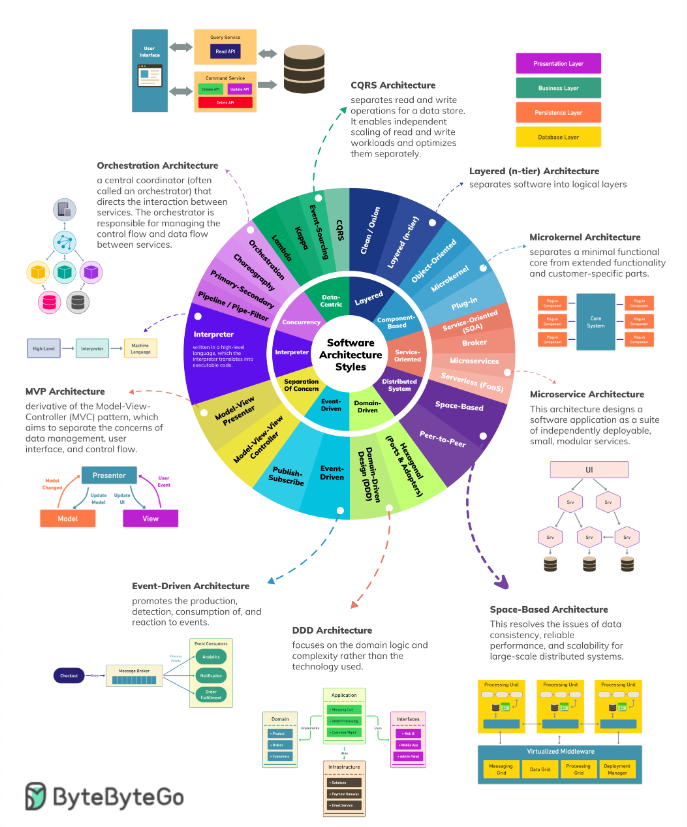

# Design Patterns & Architecture Guide

A comprehensive collection of **design patterns**, **architectural patterns**, and **enterprise solutions** for modern C# development. This repository contains production-ready examples, interview preparation materials, and real-world implementations used by top-tier companies like Shopify, Uber, Booking.com, and Netflix.

---

## 📑 Table of Contents

1. [Creational Patterns](#creational-patterns)
2. [Structural Patterns](#structural-patterns)
3. [Behavioral Patterns](#behavioral-patterns)
4. [Data Access Patterns](#data-access-patterns)
5. [Architectural Patterns](#architectural-patterns)
6. [Advanced Patterns & Combinations](#advanced-patterns--combinations)

---

<a id="creational-patterns"></a>
## 🎯 Creational Patterns

Patterns for object creation mechanisms, trying to create objects in a manner suitable to the situation.

### 1. [Singleton Pattern](/1-Singleton/)

**Definition**: Ensures a class has only one instance in the entire application and provides a global, centralized point of access to that instance.

**Key Concepts**:
- Only one instance of the class can ever exist
- Class controls its own creation (private constructor)
- Global access point to retrieve that instance
- Often used for shared resources: configuration, logging, caching, database connections

**Files**:
- [`Info.md`](/1-Singleton/Info.md) - Definition, key points, and basic Singleton implementation in C#
- [`Interview.md`](/1-Singleton/Interview.md) - Interview questions and answers, including double-checked locking patterns and `Lazy<T>` implementation

**Use Cases**: Logger, configuration manager, connection pools, feature toggles, cache managers

---

### 2. [Factory Pattern](/3-Factory/)

**Definition**: A creational design pattern that provides an interface for creating instances while letting subclasses decide which class to instantiate.

**Variants**:
- **Simple Factory** - Not a GoF pattern, but commonly used; one central class creates objects based on input
- **Factory Method** - GoF pattern; uses inheritance and polymorphism
- **Abstract Factory** - Creates families of related or dependent objects

**Files**:
- [`1-Info.md`](/3-Factory/1-Info.md) - Introduction to Factory Pattern, structure diagram, basic implementation
- [`1.1-SimpleFactoryVsFactoryMethod.md`](/3-Factory/1.1-SimpleFactoryVsFactoryMethod.md) - Clear comparison, when to use each variant
- [`2-Info-Abstract-Factory.md`](/3-Factory/2-Info-Abstract-Factory.md) - Abstract Factory for families of objects (cross-platform UI example)
- [`3.1-FactoryMethodVsAbstractFactory.md`](/3-Factory/3.1-FactoryMethodVsAbstractFactory.md) - Detailed comparison of Factory Method vs Abstract Factory
- [`3.2-FactoryMethodVsAbstractFactory.md`](/3-Factory/3.2-FactoryMethodVsAbstractFactory.md) - Additional comparison resources

**Use Cases**: UI toolkit creation, database provider selection, plugin systems, payment gateway adapters

---

<a id="structural-patterns"></a>
## 🧩 Structural Patterns

This section will list structural patterns (Composite, Adapter, Facade, Bridge, Proxy, Decorator). Content coming soon.

---

<a id="data-access-patterns"></a>
## 🏗️ Data Access Patterns

Patterns for managing data persistence and access layer logic.

### 3. [Repository Pattern](/4-Repository/)

**Definition**: A design pattern that mediates between the domain and data mapping layers using a collection-like interface for accessing domain objects.

**Key Benefits**:
- Separation of concerns between business logic and data access
- Easier to mock repositories for unit testing
- Persistence ignorance - domain entities don't know about ORM details
- Centralized data access logic
- Easy to swap data providers (EF Core, Dapper, MongoDB, etc.)

**Files**:
- [`Info.md`](/4-Repository/Info.md) - Complete guide with definitions, benefits, and full C# .NET 8 implementation examples

**Use Cases**: Enterprise applications, DDD implementations, highly testable applications

---

### 4. [Unit of Work Pattern](/5-UnitOfWork/)

**Definition**: Maintains a list of objects affected by a business transaction and coordinates the writing out of changes and the resolution of concurrency problems at the end of that transaction.

**Key Benefits**:
- Atomic transactions - all changes succeed or all fail
- Single point of save - `SaveChanges()` once per business operation
- Better performance - one database round-trip instead of many
- Clear transaction boundaries
- Easier testing - can mock `IUnitOfWork` and verify `CompleteAsync()` called once

**Files**:
- [`Info.md`](/5-UnitOfWork/Info.md) - Definition, real-world e-commerce example, full implementation with patterns and best practices

**Use Cases**: E-commerce order processing, financial transactions, complex business operations requiring atomicity

---

<a id="architectural-patterns"></a>
## 🌐 Architectural Patterns

### Top 5 Architectural Patters 


Complete architectural approaches for structuring enterprise applications.

### 5. [Hexagonal Architecture (Ports & Adapters)](/7-Hexagonal-Architecture/)

**Definition**: An architecture that keeps business logic completely independent of frameworks, databases, UI, and external services.

**Core Idea**: Your domain code should run perfectly with no Entity Framework, ASP.NET Core, RabbitMQ, or SQL Server.

**Key Concepts**:
- Driving adapters (left side): Web API, GraphQL, gRPC
- Ports: Interfaces defining contracts
- Domain: Pure business logic, no dependencies
- Driven adapters (right side): Database repositories, message publishers

**Files**:
- [`Info.md`](/7-Hexagonal-Architecture/Info.md) - Comprehensive guide with visual diagrams, full implementation example in C#

**Used By**: Netflix, Uber, Amazon (parts), Miro, Deliveroo

---

### 6. [Clean Architecture](/8-Clean-Architecture/)

**Definition**: An architecture that separates the core business rules from external concerns like UI, databases, and frameworks, making the system easy to test, maintain, and evolve.

**Core Principle**: Dependencies flow **inward** to the domain. The domain knows NOTHING about outer layers.

**Layers**:
- **Entities**: Business entities (pure C#)
- **Use Cases**: Business rules and orchestrators
- **Interfaces/Ports**: Adapters' contracts
- **Adapters**: UI, database, external services

**Key Benefits**:
- High testability - core runs without DB/UI
- Framework independence - swap ASP.NET for Blazor easily
- Database independence - EF Core to Dapper to MongoDB
- Business-focused code
- Scalability and longevity (10+ year systems)

**Files**:
- [`Info.md`](/8-Clean-Architecture/Info.md) - Full real-world e-commerce example, project structure, layer responsibilities

**Used By**: Most enterprise .NET teams, Miro, Deliveroo, Uber (parts), Shopify, banking systems

---

### 7. [Vertical Slice Architecture](/10-Vertical-Slice-Architecture/)

**Definition**: Organize code by business feature, not technical layers. Each slice = one complete business capability.

**Traditional Layered (Horizontal)**:
```
src/
├── Application/      ← All commands, queries, DTOs
├── Domain/           ← All entities
├── Infrastructure/   ← All repos, services
└── Web/              ← All controllers
```

**Vertical Slice (2025 Standard)**:
```
src/
└── Features/
    ├── Products/
    │   ├── CreateProduct/
    │   ├── GetProduct/
    │   └── UpdatePrice/
    ├── Orders/
    └── Users/
```

**Benefits**:
- Faster development - all code for a feature lives together
- Better maintainability - independent slices
- Easier refactoring - change one feature without affecting others
- Better for large teams - work on different features in parallel

**Files**:
- [`Info.md`](/10-Vertical-Slice-Architecture/Info.md) - 2025 gold standard implementation with .NET 8 Minimal APIs example

**Used By**: GitHub, Stripe, Miro, Shopify, Uber, most elite .NET teams

---

## 🎓 Domain-Driven Design (DDD)

Advanced patterns for building complex business domains.

### 8. [Domain-Driven Design (DDD)](/9-DDD/)

**Definition**: A software development approach focused on making code speak the same language as business experts — forever.

**Strategic DDD**:
- **Ubiquitous Language**: Same words in code, meetings, UI, tickets, database
- **Bounded Context**: Explicit boundary where a particular model is valid
- **Context Map**: How bounded contexts talk to each other
- **Core Domain**: The part that makes you unique/money
- **Subdomains**: Supporting or generic domains

**Tactical DDD**:
- **Value Objects**: Immutable, equality by value
- **Entities**: Have identity and lifecycle
- **Aggregates**: Consistency boundary and transactional root
- **Domain Events**: Facts that something important happened
- **Domain Services**: Logic that doesn't belong to one entity
- **Repositories**: Persistence of aggregates

**Files**:
- [`1-Info.md`](/9-DDD/1-Info.md) - Definitive 2025 C# guide with production-ready examples, no theory-only bullshit
- [`2-DDD-CQRS-EventSourcing-Clean-Architecture.md`](/9-DDD/2-DDD-CQRS-EventSourcing-Clean-Architecture.md) - The ultimate 2025 stack combining Clean Architecture, DDD, CQRS, and Event Sourcing

**Used By**: Shopify, Uber, Booking.com, Miro, Deliveroo, Klarna, most serious fintechs, airlines, logistics

---

<a id="advanced-patterns--combinations"></a>
## 🚀 Advanced Patterns & Combinations

Complex patterns combining multiple architectural approaches.

### 9. [CQRS (Command Query Responsibility Segregation)](/6-CQRS/)

**Definition**: Separates the model for updates (Command) from the model for reads (Query). Different models can be optimized for their specific purpose.

**Core Benefits**:
- Optimized read performance using denormalized read models
- Natural support for event-driven architecture
- Easy to implement eventual consistency
- Better scalability - read and write sides scale independently

**Files**:
- [`1-Info.md`](/6-CQRS/1-Info.md) - Introduction to CQRS pattern, command and query models
- [`2-EventSourcingWithCQRS.md`](/6-CQRS/2-EventSourcingWithCQRS.md) - The ultimate combination with Event Sourcing for auditable, scalable systems
- [`3-DDD-with-CQRS.md`](/6-CQRS/3-DDD-with-CQRS.md) - Domain-Driven Design with CQRS & Event Sourcing in production-ready .NET 8

**Use Cases**: Event-driven systems, audit-required applications, high-performance reads, microservices

---

<a id="behavioral-patterns"></a>
## 🔄 Behavioral Patterns

Patterns that focus on communication between objects and distribution of responsibility.

### 10. [Iterator Pattern](/2-Iterator/)

**Definition**: Provides a way to access the elements of a collection sequentially without exposing the underlying data structure.

**Key Benefits**:
- Decouples traversal logic from collection implementation
- Collection can change internally without affecting clients
- Support for multiple simultaneous iterations
- Support for different collection types with unified interface

**Files**:
- [`Info.md`](/2-Iterator/Info.md) - Complete guide with custom iterator implementation in C#

**Use Cases**: Custom collections, tree traversal, iterator protocols, lazy loading

---

## 📚 Additional Resources

- **`sample.md`** - Sample documentation template for creating new pattern guides

---

## 🎯 Quick Reference by Use Case

| Use Case | Pattern | Location |
|----------|---------|----------|
| Ensure single instance of a class | Singleton | `/1-Singleton/` |
| Create objects without specifying exact classes | Factory | `/3-Factory/` |
| Access collection elements without exposing structure | Iterator | `/2-Iterator/` |
| Abstract data access from business logic | Repository | `/4-Repository/` |
| Atomic transactions across multiple repositories | Unit of Work | `/5-UnitOfWork/` |
| Separate commands from queries | CQRS | `/6-CQRS/` |
| Domain-independent business logic | Hexagonal Architecture | `/7-Hexagonal-Architecture/` |
| Independent frameworks and external concerns | Clean Architecture | `/8-Clean-Architecture/` |
| Modeling complex business domains | DDD | `/9-DDD/` |
| Organize by business features, not layers | Vertical Slice | `/10-Vertical-Slice-Architecture/` |
| Immutable event-based state management | Event Sourcing + CQRS | `/6-CQRS/` |

---

## 🎯 Learning Path

**Beginner** → Start with:
1. Singleton Pattern
2. Factory Pattern
3. Iterator Pattern

**Intermediate** → Continue with:
1. Repository Pattern
2. Unit of Work Pattern
3. Clean Architecture

**Advanced** → Master:
1. Hexagonal Architecture
2. Domain-Driven Design
3. Vertical Slice Architecture
4. CQRS + Event Sourcing

**Expert** → Combine all with:
- Clean Architecture + DDD + CQRS + Event Sourcing (The Ultimate 2025 Stack)

---

## 💡 Key Principles Across All Patterns

1. **SOLID Principles**
   - Single Responsibility: Each class has one reason to change
   - Open/Closed: Open for extension, closed for modification
   - Liskov Substitution: Subtypes must be substitutable for base types
   - Interface Segregation: Many client-specific interfaces are better than one general purpose
   - Dependency Inversion: Depend on abstractions, not concretions

2. **Don't Repeat Yourself (DRY)**: Avoid duplication of logic

3. **Separation of Concerns**: Each component should have a single, well-defined responsibility

4. **Dependency Injection**: Inject dependencies rather than creating them internally

5. **Composition over Inheritance**: Prefer composition to achieve flexibility

6. **DRY Code**: Centralize business logic in one place

---

## 🔗 Pattern Relationships

```
Creational        Structural        Behavioral
─────────         ──────────        ───────────
├─ Singleton      ├─ (included)     ├─ Iterator
├─ Factory        │                 └─ (more)
└─ (more)         └─ (more)

    ↓ Combined in ↓

  Data Access Patterns
  ─────────────────────
  ├─ Repository
  └─ Unit of Work

    ↓ Organized by ↓

  Architectural Patterns
  ──────────────────────
  ├─ Hexagonal
  ├─ Clean
  ├─ Vertical Slice
  └─ DDD

    ↓ Enhanced with ↓

  Advanced Combinations
  ──────────────────────
  ├─ CQRS
  ├─ Event Sourcing
  └─ DDD + CQRS + Event Sourcing + Clean
```

---

## 📖 File Structure Overview

```
DesignPatterns/
├── ReadMe.md                           ← You are here
├── sample.md                           ← Template for new guides
├── 1-Singleton/
│   ├── Info.md                         (Definitions and implementation)
│   └── Interview.md                    (Interview Q&A)
├── 2-Iterator/
│   └── Info.md                         (Custom iterator implementation)
├── 3-Factory/
│   ├── 1-Info.md                       (Factory introduction)
│   ├── 1.1-SimpleFactoryVsFactoryMethod.md
│   ├── 2-Info-Abstract-Factory.md
│   ├── 3.1-FactoryMethodVsAbstractFactory.md
│   └── 3.2-FactoryMethodVsAbstractFactory.md
├── 4-Repository/
│   └── Info.md                         (Complete Repository pattern guide)
├── 5-UnitOfWork/
│   └── Info.md                         (Unit of Work with e-commerce example)
├── 6-CQRS/
│   ├── 1-Info.md                       (CQRS introduction)
│   ├── 2-EventSourcingWithCQRS.md      (Event Sourcing + CQRS combination)
│   └── 3-DDD-with-CQRS.md              (DDD + CQRS + Event Sourcing)
├── 7-Hexagonal-Architecture/
│   └── Info.md                         (Ports and adapters architecture)
├── 8-Clean-Architecture/
│   └── Info.md                         (Clean Architecture full guide)
├── 9-DDD/
│   ├── 1-Info.md                       (Domain-Driven Design definitive guide)
│   └── 2-DDD-CQRS-EventSourcing-Clean-Architecture.md (The ultimate 2025 stack)
└── 10-Vertical-Slice-Architecture/
    └── Info.md                         (Vertical Slice 2025 gold standard)
```

---

## 🚀 Getting Started

1. **Read the main concepts**: Start with README sections that interest you
2. **Study Info.md files**: Deep dive into pattern definitions and examples
3. **Review Interview.md files**: Prepare for technical interviews
4. **Compare alternatives**: Use comparison documents to understand trade-offs
5. **Implement examples**: Build the provided code samples in your projects
6. **Combine patterns**: Learn how patterns work together in advanced sections

---

## 📝 Notes

- All examples are in **C#** (.NET 8/9)
- Code is **production-ready** and used by major companies
- Patterns include **real-world examples** and use cases
- Interview preparation materials included
- No theory-only bullshit — practical, applicable knowledge

---

**Last Updated**: December 2025

**Level**: Beginner → Intermediate → Advanced → Expert
